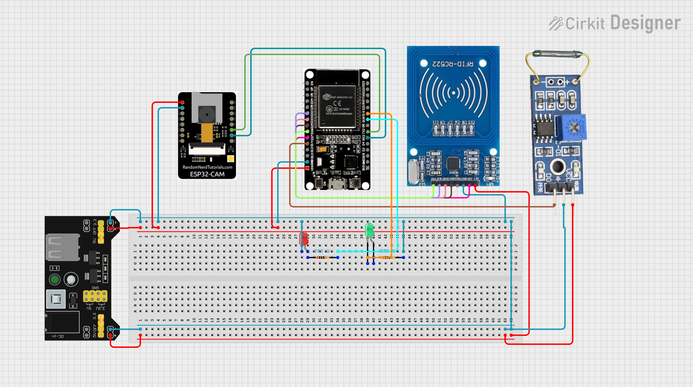
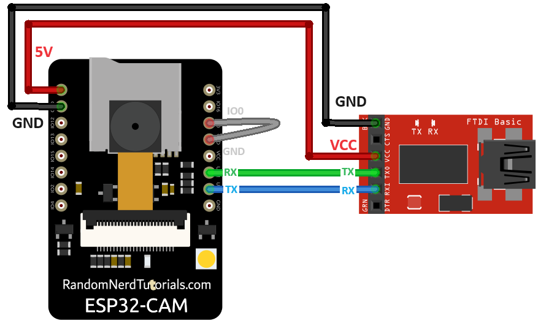

# ESP32 Security System Tutorial
*Arduino-based door alarm with RFID arming, reed switch trigger, and ESP32-CAM photo capture*

[Video Demo!](https://youtu.be/lcdtWoCZPhM)

## Project Overview

This project builds a simple security system using two ESP32 boards:

- **Main ESP32 Dev Board**: Reads an RFID card for arming/disarming, monitors a magnetic reed switch on a door, controls status LEDs, and coordinates with the camera board.
- **ESP32-CAM Board**: Listens for commands over UART. When it receives "PHOTO", it takes three pictures, saves them to a microSD card, and sends the last image back to the main board.

**How it works**:
1. User taps an authorized RFID card to arm the system (green LED on).
2. If the door opens (reed switch triggers) while armed, the main board sends a "PHOTO" command via UART to the CAM board.
3. The CAM board captures three photos, saves all to the SD card, and streams the last photo back to the main board.
4. User taps the RFID card again to disarm (red LED on).

**Why send the image back?**: The image data received by the main board is buffered in memory, ready for future expansion. For example, you could add a cellular SIM module (like SIM800L) to text the photo to a phone. This project builds the foundation for that extension.

**Key concepts for students**: UART communication, SPI for RFID, GPIO input/output, task scheduling on dual-core ESP32, SD card file writing.

---

## Bill of Materials

| Component                    | Quantity   | Notes                                        | Example Purchase Link                                                                          |
| ---------------------------- | ---------- | -------------------------------------------- | ---------------------------------------------------------------------------------------------- |
| ESP32 Dev Board (Dev Module) | 1          | Main controller, has USB port                | [Amazon](https://www.amazon.com/dp/B0D8T53CQ5)                                                 |
| AI Thinker ESP32-CAM         | 1          | Camera module with microSD slot, no USB port | [Amazon](https://www.amazon.com/dp/B09TB1GJ7P)                                                 |
| CP2102 USB-to-TTL Adapter    | 1          | For flashing the ESP32-CAM                   | [Amazon](https://www.amazon.com/dp/B00LODGRV8)                                                 |
| MFRC522 RFID Module          | 1          | Includes RFID card/tag                       | [Kit Link](https://www.amazon.com/EL-KIT-001-Project-Complete-Starter-Tutorial/dp/B01CZTLHGE/) |
| Magnetic Reed Switch         | 1          | Normally open type                           | [Kit Link](https://www.amazon.com/EL-KIT-001-Project-Complete-Starter-Tutorial/dp/B01CZTLHGE/) |
| MicroSD Card                 | 1          | 32GB, typically pre-formatted FAT32          | [Amazon](https://www.amazon.com/dp/B0749KG1JK)                                                 |
| LEDs (Red, Green)            | 1 each     | 5mm or 3mm                                   | [Kit Link](https://www.amazon.com/EL-KIT-001-Project-Complete-Starter-Tutorial/dp/B01CZTLHGE/) |
| Resistors                    | 2x 220 ohm | For LED current limiting                     | [Kit Link](https://www.amazon.com/EL-KIT-001-Project-Complete-Starter-Tutorial/dp/B01CZTLHGE/) |
| Breadboard + Jumper Wires    | 1 set      | Dual power rails recommended                 | [Kit Link](https://www.amazon.com/EL-KIT-001-Project-Complete-Starter-Tutorial/dp/B01CZTLHGE/) |
| External Power Supply        | 1          | Provides both 5V and 3.3V rails              | [Kit Link](https://www.amazon.com/EL-KIT-001-Project-Complete-Starter-Tutorial/dp/B01CZTLHGE/) |

**Power note**: All logic signals (GPIO pins) on ESP32 boards operate at 3.3V. The RC522 RFID module and reed switch in this project are powered at 3.3V. The ESP32-CAM is powered at 5V via its 5V pin, but its GPIO pins remain 3.3V logic.

---

## Wiring and Assembly



### Power Rail Setup

1. Set up your breadboard with two separate power rails:
   - **5V rail**: Connect to the ESP32-CAM 5V pin and to the anodes of the LEDs (through 220 ohm resistors).
   - **3.3V rail**: Connect to the ESP32 Dev Board 3.3V pin, the RC522 VCC pin, and one side of the reed switch.
2. Connect all ground (GND) pins together: ESP32 Dev Board GND, ESP32-CAM GND, RC522 GND, reed switch GND side, and power supply GND. This common ground is essential for communication.
3. **Important when flashing the main ESP32 via USB**: When the main ESP32 is connected to your computer via USB for code upload, do NOT connect the external power supply's 5V VIN wire to the breadboard. Keep only the GND connection intact. This prevents conflict between USB power and the external supply. After uploading code, you can reconnect the VIN wire for normal operation with external power.

### Pin Connections

#### Main ESP32 Dev Board Connections

| Main ESP32 Pin | Connects To                                                    | Notes                           |
| -------------- | -------------------------------------------------------------- | ------------------------------- |
| 3.3V           | RC522 VCC, one side of reed switch                             | All logic at 3.3V               |
| GND            | RC522 GND, reed switch other side, ESP32-CAM GND, LED cathodes | Common ground                   |
| GPIO 14        | Reed switch signal side                                        | Configured as INPUT in code     |
| GPIO 19        | Green LED anode (via 220 ohm resistor)                         | Cathode to GND                  |
| GPIO 18        | Red LED anode (via 220 ohm resistor)                           | Cathode to GND                  |
| GPIO 17 (TX2)  | ESP32-CAM GPIO 3 (U0RXD)                                       | UART2 transmit to CAM receive   |
| GPIO 16 (RX2)  | ESP32-CAM GPIO 1 (U0TXD)                                       | UART2 receive from CAM transmit |
| GPIO 26        | RC522 SDA (MOSI)                                               | SPI data                        |
| GPIO 32        | RC522 SCK                                                      | SPI clock                       |
| GPIO 33        | RC522 MOSI                                                     | SPI master out                  |
| GPIO 25        | RC522 MISO                                                     | SPI master in                   |
| GPIO 27        | RC522 RST                                                      | Reset pin                       |

#### ESP32-CAM UART Pin Reference

The AI Thinker ESP32-CAM has two pins labeled **U0RXD** and **U0TXD** located just above the GND pin on the board edge. These correspond to:
- **U0RXD = GPIO 3** (receive pin for UART0)
- **U0TXD = GPIO 1** (transmit pin for UART0)

Connect these to the main board as shown in the table above. Double-check this cross-connection: TX on one board must go to RX on the other.

#### ESP32-CAM Flashing Setup (CP2102 Adapter)

This wiring is ONLY for when you need to flash (program) the CAM board.



| CP2102 Pin | ESP32-CAM Pin  | Purpose                                 |
| ---------- | -------------- | --------------------------------------- |
| 3.3V       | 3.3V           | Power during flash only (do not use 5V) |
| GND        | GND            | Common ground                           |
| TX         | GPIO 1 (U0TXD) | Data to CAM receive pin                 |
| RX         | GPIO 3 (U0RXD) | Data from CAM transmit pin              |
| GND        | GPIO 0         | Hold LOW to enter flash mode            |

**Flashing steps**:
1. Wire the CP2102 adapter as shown above, ensuring GPIO 0 is connected to GND.
2. In Arduino IDE, select Board: "AI Thinker ESP32-CAM".
3. Upload the cam_board.ino sketch.
4. **Critical**: After upload completes, REMOVE the wire connecting GPIO 0 to GND. Then press the ESP32-CAM's EN/RST button to restart.
5. Open Serial Monitor at 115200 baud. You should see "CAM_READY".

**Why remove the GPIO 0 wire?**: GPIO 0 determines the ESP32-CAM's boot mode. When grounded during power-up, the chip enters flash mode and will not run your code. For normal operation, GPIO 0 must be floating (unconnected) or pulled high.

For detailed visual instructions, follow this guide:  
[Random Nerd Tutorials: Program ESP32-CAM](https://randomnerdtutorials.com/program-upload-code-esp32-cam/)

#### SD Card Preparation

- Most new microSD cards of 32GB or smaller come pre-formatted as FAT32 from the manufacturer. If your card is new and 32GB, you likely do not need to reformat it.
- If you encounter SD card initialization errors, format the card as FAT32 using the [SD Memory Card Formatter](https://www.sdcard.org/downloads/formatter/).
- Insert the card into the ESP32-CAM slot before powering on the board.
- Photos will be saved with filenames like `/photo_1.jpg`, `/photo_2.jpg`, etc.

#### Note on Boot Sequence and CAM_READY

The main board waits up to 25 seconds after startup to receive a "CAM_READY" message from the ESP32-CAM. If you power on or flash the CAM board separately before connecting it to the main board, the main board will not see that initial CAM_READY message. This is expected and not a problem. When both boards are powered together in the final setup, the handshake will work correctly. If you test the CAM board alone first, you can verify it outputs "CAM_READY" to its own Serial Monitor.

---

## Software Setup

### Step 1: Install Arduino IDE and ESP32 Board Support

1. Download and install the Arduino IDE from https://www.arduino.cc/en/software
2. Open the Arduino IDE.
3. Go to File > Preferences.
4. In the "Additional Boards Manager URLs" field, paste:
   ```
   https://raw.githubusercontent.com/espressif/arduino-esp32/gh-pages/package_esp32_index.json
   ```
5. Go to Tools > Board > Boards Manager.
6. Search for "esp32" and install "ESP32 by Espressif Systems" (version 2.0.17 or later).
7. Restart the Arduino IDE.

### Step 2: Install Required Libraries

1. In Arduino IDE, go to Tools > Manage Libraries.
2. Search for and install:
   - `MFRC522` by Miguel Balboa (version 1.4.12 or later)
3. Note: The `esp_camera` library used by the CAM board is built into the ESP32 board package and does not need separate installation.

### Step 3: Prepare the Arduino Projects

This project uses two separate sketches, one for each board. You have two options for organizing them:

- [Main Board Code](./main_board.ino)
- [Cam Board Code](./cam_board.ino)

**Option A: Separate project folders (recommended for clarity)**
1. Create a folder named `ESP32_Security_Main`.
2. Inside it, create a file named `main_board.ino` and paste the main board code.
3. Create a second folder named `ESP32_Security_CAM`.
4. Inside it, create a file named `cam_board.ino` and paste the CAM board code.
5. Open each folder separately in Arduino IDE when uploading to the corresponding board.

**Option B: Single folder with multiple .ino files**
1. Create a folder named `ESP32_Security_Project`.
2. Inside it, create two files: `main_board.ino` and `cam_board.ino`.
3. When you open `main_board.ino` in Arduino IDE, the IDE will treat it as the active sketch. Upload to the main board.
4. Then open `cam_board.ino` in Arduino IDE (File > Open) and upload to the CAM board.

**Important**: Arduino IDE only uploads the file that matches the folder name (or the file you have open as the main sketch). Always verify which .ino file is active before clicking Upload.

#### Configuring main_board.ino

1. Open `main_board.ino` in Arduino IDE.
2. Find your RFID card's UID:
   - Upload the code temporarily without changes.
   - Open Serial Monitor at 115200 baud.
   - Tap your authorized RFID card near the reader.
   - Note the printed UID (e.g., `F9 49 B0 05`).
   - Stop the upload, then edit the authorizedUID array to match your card:
     ```cpp
     byte authorizedUID[4] = {0xF9, 0x49, 0xB0, 0x05}; // Replace with YOUR UID bytes
     ```
3. Verify the pin definitions match your wiring:
   ```cpp
   #define REED_PIN 14
   #define CAM_TX 17   // Main TX -> CAM RX (GPIO 3)
   #define CAM_RX 16   // Main RX <- CAM TX (GPIO 1)
   #define RC_SDA 26   // SPI pins for RC522
   #define RC_SCK 32
   #define RC_MOS 33
   #define RC_IMI 25
   #define RC_RST 27
   ```

#### Configuring cam_board.ino

1. Open `cam_board.ino` in Arduino IDE.
2. The camera configuration is pre-set for the AI Thinker ESP32-CAM. No changes are needed for standard hardware.
3. Optional: Adjust photo settings if desired:
   ```cpp
   config.frame_size = FRAMESIZE_VGA;  // Options: FRAMESIZE_CIF, VGA, SVGA, etc.
   config.jpeg_quality = 10;           // Lower number = better quality, larger file size
   ```

### Step 4: Upload to Main ESP32 Dev Board

1. Connect the main ESP32 Dev Board to your computer via USB cable.
2. In Arduino IDE, configure:
   - Board: "ESP32 Dev Module"
   - Port: [Select your COM port]
   - Upload Speed: default or 115200
3. **Critical**: Ensure the external power supply's 5V VIN wire is disconnected from the breadboard (keep GND connected).
4. Click the Upload button.
5. After upload completes, reconnect the VIN wire to restore full power from the external supply.

### Step 5: Upload to ESP32-CAM Using CP2102 Adapter

1. Wire the CP2102 adapter to the ESP32-CAM as described in the Wiring section.
2. In Arduino IDE, configure:
   - Board: "AI Thinker ESP32-CAM"
   - Port: [Select the CP2102 COM port]
   - Ensure GPIO 0 is grounded during upload
3. Click Upload.
4. After upload:
   - Remove the wire connecting GPIO 0 to GND.
   - Press the ESP32-CAM's EN/RST button to restart.
   - Open Serial Monitor at 115200 baud. You should see "CAM_READY".

### Step 6: Final System Check

1. Power both boards using the external power supply (ensure all wires are reconnected, including the VIN wire to the main ESP32).
2. **Observe the LEDs on the main board**:
   - Red LED should be ON initially (system starts disarmed)
   - Green LED should be OFF initially
3. **Test arming**: Tap the authorized RFID card near the reader. The green LED should turn ON and the red LED should turn OFF, indicating the system is armed.
4. **Test the alarm**: While armed, separate the reed switch contacts (simulate opening a door). You should observe:
   - The ESP32-CAM's onboard LED may flash briefly during photo capture
   - After a few seconds, the system returns to monitoring state
5. **Test disarming**: Tap the authorized RFID card again. The red LED should turn ON and the green LED should turn OFF.
6. **Verify photos were saved**: Power down the system, remove the microSD card from the ESP32-CAM, and insert it into a computer. Open the `photo_*.jpg` files to confirm images were captured.

**Optional: Serial Monitor verification**
If you want to see debug output during testing:
- Keep the main ESP32 connected to USB *in addition to* the external power supply
- Ensure the external 5V VIN wire is disconnected from the breadboard while USB is connected (to avoid power conflict)
- Open Serial Monitor at 115200 baud to view status messages
- When finished monitoring, disconnect USB and reconnect the VIN wire for standalone operation

---

## Testing and Operation

1. **Arm the system**: Tap the authorized RFID card near the reader. The green LED should turn on, and the Serial Monitor should display "System armed via RFID".
2. **Trigger the alarm**: Open the door (separate the reed switch contacts). Observe:
   - Serial Monitor shows: `*** ALARM TRIGGERED: Door Opened ***`
   - The ESP32-CAM saves three photos to the SD card (`/photo_1.jpg`, `/photo_2.jpg`, `/photo_3.jpg`)
   - The last photo is streamed back to the main board and buffered in memory
3. **Disarm the system**: Tap the authorized RFID card again. The red LED should turn on, and the Serial Monitor should display "System disarmed via RFID".
4. **View captured photos**: Power down the system, remove the microSD card from the ESP32-CAM, and insert it into a computer. Open the `photo_*.jpg` files with any image viewer.

---

## Troubleshooting

### CAM board not responding or "CAM did not report ready"

- **Check UART wiring**: Verify that Main GPIO 17 connects to CAM GPIO 3 (U0RXD), and Main GPIO 16 connects to CAM GPIO 1 (U0TXD). TX must go to RX.
- **Check common ground**: Ensure all GND pins are connected together.
- **Check CAM power**: The ESP32-CAM 5V pin must be connected to the 5V rail. During normal operation, GPIO 0 should not be grounded.
- **Check Serial Monitor baud rate**: Both boards use 115200 baud. Ensure your monitor is set correctly.
- **Re-flash the CAM board**: Follow the flashing steps again, ensuring GPIO 0 is grounded only during upload and removed afterward.

### RFID card not detected

- **Check SPI wiring**: Verify connections for SDA, SCK, MOSI, MISO, RST, and GND between the main ESP32 and RC522.
- **Check RC522 power**: The module VCC should be connected to 3.3V (not 5V) as confirmed in your build.
- **Check antenna orientation**: Hold the RFID card flat against the reader module for best results.
- **Verify UID in code**: Ensure the `authorizedUID` array in `main_board.ino` exactly matches your card's printed UID bytes.

### SD card write errors on ESP32-CAM

- **Check card format**: Most new 32GB cards come pre-formatted as FAT32. If you get errors, reformat using the official SD Memory Card Formatter tool.
- **Check card insertion**: Ensure the microSD card is fully seated in the slot.
- **Check card capacity**: The project was tested with a 32GB card. Larger cards may require additional configuration.
- **Power stability**: The ESP32-CAM draws significant current during photo capture. Ensure your 5V supply can provide at least 500mA.

### Photos not streaming back to main board

- **Check UART buffer settings**: The main board code sets `Serial2.setRxBufferSize(2048)`. Do not change this unless you also adjust the receive logic.
- **Check for interference**: Keep UART wires short and away from high-current paths.
- **Verify protocol timing**: The CAM board sends "IMG:<size>" followed by raw bytes and "IMG_END". Ensure no extra serial output is interfering.

### LEDs not lighting correctly

- **Check resistor orientation**: LEDs are polarized. The longer leg (anode) connects to the GPIO pin through the resistor; the shorter leg (cathode) connects to GND.
- **Check GPIO definitions**: Verify that `LED_GREEN` and `LED_RED` in the code match your physical wiring (GPIO 19 and 18 by default).
- **Check power rail**: LED anodes should connect to the 5V rail through resistors; cathodes to GND.

### General upload issues

- **ESP32 Dev Board not detected**: Try a different USB cable. Some cables are power-only.
- **ESP32-CAM upload fails**: Ensure GPIO 0 is grounded during upload, and that you have selected "AI Thinker ESP32-CAM" as the board. Remember to remove the GPIO 0 ground wire after upload.
- **Port not listed**: Install CP2102 drivers from https://www.silabs.com/developers/usb-to-uart-bridge-vcp-drivers if using Windows.

---

## Notes for Instructors

- **Estimated build time**: 2-3 lab sessions for freshman students.
- **Key learning objectives**: UART communication, SPI protocol, GPIO configuration, task scheduling on dual-core microcontrollers, file system operations.
- **Common student pitfalls**: Reversing UART TX/RX connections, forgetting common ground, incorrect RFID UID entry, leaving GPIO 0 grounded on ESP32-CAM after flashing.
- **Extension ideas**: Add a cellular SIM module (e.g., SIM800L) to text the buffered photo to a phone, implement a keypad for PIN-based arming, add a buzzer for audible alarm.

---
